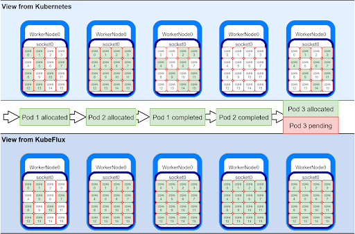
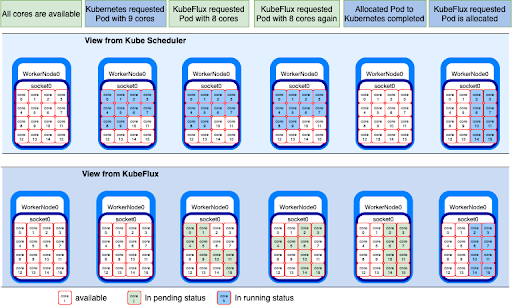

** **

## HPC Scheduling on Kubernetes with KubeFlux

** **

## 1.   Vision and Goals Of The Project:

Kubernetes provides an open source platform to deploy, scale and manage container based applications. High performance computing (HPC) and cloud technologies are increasingly coupled to accelerate the convergence of traditional HPC with new simulation, data analysis, machine-learning, and artificial intelligence approaches. While the HPC and cloud paradigm is increasingly being adopted, several key mismatches between HPC and cloud technologies still preclude this paradigm from realising its full potential.

Kubernetes's default scheduler, initially intended for microservice with limited requirements, is now facing some issues in handling huge HPC load. IBM Research, Lawrence Livermore National Laboratory, and Red Hat share a common vision to bring complete HPC scheduling awareness into Kubernetes. KubeFlux, a scheduler plug-in for Kubernetes that uses Flux's advanced graph-based scheduler, Fluxion as the module taking pod placements decision. There are various aspects of workload management that needs KubeFlux attention like co-scheduling, job throughput, coordination, portability and extremely heterogeneous resources.

In this project, we are looking at the Job coordination aspect of KubeFlux. Our goal was to build a controller that can manage job cancellation at KubeFlux level when pods are completed/terminated, so that KubeFlux internal status reflects the actual state of the cluster. KubeFlux also needs a method that can dynamically update its internal status when sharing resources between Kubernetes and KubeFlux, when jobs are deployed by Kubernetes itself or other schedulers on the same shared resources. Overall our vision is to enhance KubeFlux so that it provides smooth job management service.

** **
## 2. Users/Personas Of The Project:

This is an open source project. The users range from Academic researchers to Companies who want to run containerized performance sensitive workloads on Kubernetes/OpenShift platforms. 

User 1: Accelerating Therapeutics for Opportunities in Medicine (ATOM) Consortium is developing a modelling Pipeline(AMPL) for Drug Discovery, a pipeline for building models to assist in silico drug discovery. The pipeline includes a few machine learning and deep learning frameworks used to perform prediction on large pharmaceutical datasets. These techniques often need multiple learners to be concurrently scheduled and started in order for the training to begin. Kubernetes current scheduler cannot manage jobs holistically. It requires jobs to be broken down as soon as they are received by the API server. This may cause problems like excessive number of pending pods in times of high demand which may overwhelm the scheduler and decrease the overall cluster’s performance significantly.

Use Case 1: A computational fluid dynamics (CFD) problem may execute in parallel across many hundred or even thousands of nodes using a message passing library to synchronise state. This requires specialised scheduling and job management features to allocate and launch such jobs and then to checkpoint, suspend/resume or backfill them.

Use Case 2: GROMACS is a package used for molecular dynamic simulations. These simulations are evaluating millions of interactions for billion time steps which requires huge computation hardware and time. GROMACS job executes with multi-level parallelism that distributes computational work across ensembles of simulation, multiple cores working on each domain exploiting instruction-level parallelism across those cores. Kubernetes was built for orchestrating containerized microservices applications. Currently Kubernetes scheduler naïve support for distributed memory jobs is one of the major gaps along with no job queueing system for GROMACS kind of workload.

Kubernetes typically deploy long-running services, like web servers and it is highly dynamic with pods coming and going, this still differs greatly from HPC application patterns. Through this project we intend to keep the process of job scheduling as efficient as possible along with reducing the overhead of a scheduler. This way we continue to provide any Kubernetes’s audience the plugin KubeFlux for HPC jobs along with the other features.

** **

## 3.   Scope and Features Of The Project:

There are several aspects to be addressed when using third-party software to take scheduling decisions in a Kubernetes cluster. For this project, we focus on two aspects when we integrate a plugin scheduler like Flux:

### 3.1 Introduction to Kube-Flux

Kubernetes was originally for scheduling and deploying microservices, however, the platform has garnered popularity and its lack of accommodation for different types of workloads became apparent. 

Kube-Flux is plug-in scheduler primarily focused on enabling high performance computing on Kubernetes. Kube-Flux in its current state works as a bridge between Kubernetes and Fluxion, a powerful graph library that can take scheduling decisions for HPC applications.

Single node Fluxion resource graph

Unlike Kubernetes, fluxion keeps track of cluster resources in a graph structure depicted by the diagram above. Kube-Flux achieves the integration between K8s and Flux by translating Kubernetes pod-specifications to Fluxion job specifications; pod resource allocations are then made by choosing a node with enough resources.

Fluxion’s resource graph is a powerful representation of resources that aligns more with HPC’s imperative management philosophy where the state of the resources should always match the desired state, contrary to Kubernetes’s declarative management which tries to converge between the desired and actual state.

### 3.2 KubeFlux scheduler should reflect changes in the state of its own scheduled pods

It also does not hold any information on its own pods once they are scheduled. We implemented an informer that carries updated cluster state information to the Kube-Flux resource graph. This helps to efficiently utilize the resources of a cluster and not let any job remain pending for long durations. 

### 3.3 Synchronise the KubeFlux scheduler to reflect changes in the state of pods scheduled by other schedulers.

Scheduling a pod on the cluster can be done by any third party schedulers. Broadening the scope of the project, there is a need to keep KubeFlux updated of any other scheduler that can schedule pods on the cluster except Kubernetes and itself.
KubeFlux to be aware of other schedulers that can alter the state of the cluster and update its own internal state accordingly.

** **

## 4. Solution Concept

The above scope of the project is elaborated here to represent the current working of the Kubernetes and KubeFlux simultaneously.

### 4.1 State inconsistency

The state of resources on the cluster for Kubernetes and KubeFlux is different. The number of the nodes that are occupied in the cluster, the state of the nodes that are occupied in either running, completed, terminated or cancelled state is different but incorrect for KubeFlux.  
The core scheduler of the entire Flux framework is Fluxion. Fluxion has its own internal state and resource management which keeps track of the pods created by KubeFlux. However, Fluxion does not have the capability to update the status of these pods if and when the actual status changes on the cluster. 
Below is the illustration of the same. The demonstration has a cluster with 1 worker node and 1 CPU socket. It has 16 cores in total. Initially the view of the cluster from Kubernetes and KubeFlux is that all 16 cores are available.

1. KubeFlux requested allocation of Pod 1 that requires 8 cores. Since all 16 cores were available, 8 cores were randomly assigned to the pod. 
2. KubeFlux then requested allocation of Pod 2 with 8 cores. The request is also fulfilled and the pod is created.
3. At this instance, all the cores are busy and this information is correctly visible to Kubernetes as well as KubeFlux.
4. The issue starts as soon as the state of these pods is updated. The pod 1 completed its execution and the cores are now available for allocation. However this information is only available to Kubernetes and KubeFlux is under the impression that these cores are busy and the execution is in progress.
5. Similarly, when the pod 2 completes its execution, all the cores are now available but the inconsistency is seen at KubeFlux.
6. Kubernetes has the correct view of the cluster and can successfully schedule Pod 3 on the cluster, however, KubeFlux is not able to schedule any more pods since its internal representation suggests that no more cores are available for allocation.

This state inconsistency leads to infinite wait time for any pods scheduled by KubeFlux.

State Inconsistency

### 4.2 Co-scheduling problem

The co-scheduling problem is similar to the state inconsistency problem. While the state inconsistency problem focuses on the inconsistency of state resources of its own scheduled pods for KubeFlux scheduler, the co-scheduling problem focuses on the problem of inconsistency between the Kubernetes and KubeFlux scheduler.

Below is the illustration of the same (Diagram 4.2a). The demonstration has a cluster with 1 worker node and 1 CPU socket. It has 16 cores in total. Initially the view of the cluster from Kubernetes and KubeFlux is that all 16 cores are available.

1. Kubernetes requested allocation of Pod 1 that requires 10 cores. Since all 16 cores were available, 10 cores were randomly assigned to the pod. 
2. KubeFlux then requested allocation of Pod 2 with 8 cores. Since there are only 6 cores left for allocation, the request is rejected which goes back to the scheduling queue for retry.
3. The issue with the KubeFlux scheduler not being aware of the current availability in the cluster.
4. The retry attempts by the KubeFlux scheduler are all rejected since there is no availability.
5. As soon as the pod scheduled by Kubernetes completes, KubeFlux’s scheduling request is granted and the pod is successfully allocated.

This demonstrates the co-scheduling issue and emphasises the need for KubeFlux to be aware of the cluster resources that are available at all time. Any changes to the cluster by Kubernetes scheduler or any other third party scheduler should be reflected to KubeFlux’s internal resource graph that takes the scheduling decisions.

Co-scheduling Inconsistency

## 5. Acceptance criteria

- Minimum acceptance criteria:
    - Implementing a controller for job cancellation management (for pods allocated by KubeFlux).
    - The informer component of the controller shall inform KubeFlux of state changes for its allocated pods in the cluster.
    - KubeFlux shall have an updated view of the state of its allocated pods either when said state is changed or when KubeFlux needs to make a scheduling decision.

- Stretch goal:
    - Proposing methodologies to dynamically update Fluxion's internal graph of resources to address resource sharing between Kubernetes and Fluxion (for pods allocated by other    schedulers).
    - The system shall provide an interface for adding resource sharing polices.

## 6.  Release Planning:

- Release 1
    - Learn about Kubernetes and Fluxion
        - Read about Kubernetes architecture.
        - Focus on the functionalities of Default Scheduler in Kubernetes.
        - Understand the graph-based implementation of Flux Scheduler.
    - Building the Environment
        - Install Kubernetes for different OS.
        - Install dependencies like Helm Chart, Minikube etc.

- Release 2
    - Analysis of the underlying resource graph used by Flux to represent the Kubernetes cluster
        - Getting familiar with Golang.
        - Read Resource-query documentation.
    - Designed Pi program test and reproduced the state inconsistency issue in practice
        - Setting up Kind and Local Registry.
        - Run PI program with Default Scheduler.
        - Run PI program with KubeFlux Scheduler.

- Release 3
    - Codewalk by our mentors
        - Discus possible solutions for handling state inconsistency problem.
    - Develop the informer
        - Log file for each POD.
        - Handle more PodPhases in updatePOD Function.
        - Add PodInformer (for successful PODs).
        - Save a set of Job IDs in scheduler object.
        - Add NodInformer.
        - Create corner test cases.

- Release 4
    - Create an operator through operator-sdk
        - Create CR based on POD information.
        - Delete CR after POD completion.
        - Fetch POD and read status in reconciliation loop.
        - Add experimental code in reconciliation loop.
    - Define CustomResourceDefinition (CRD).
    - Test CRD with YAML file manually.

- Release 5
    - Demo informer in an open shift cluster (real world environment).
    - Performance analysis of the Pod Informer.
