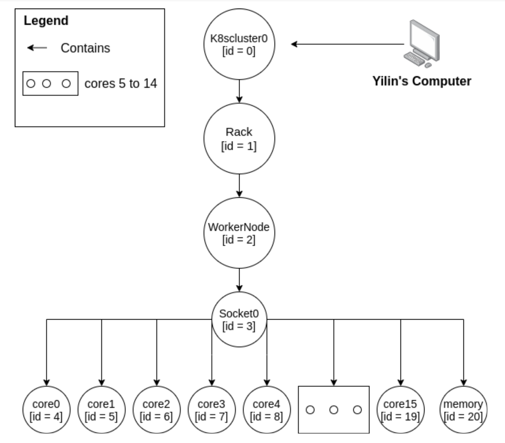
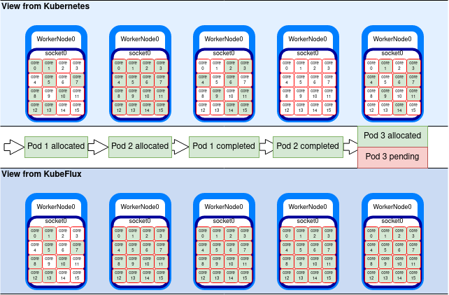
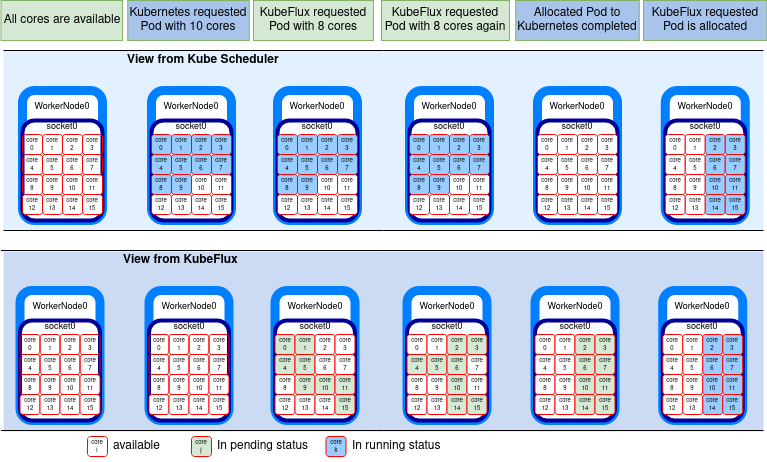
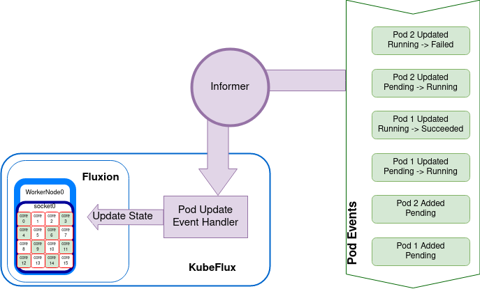
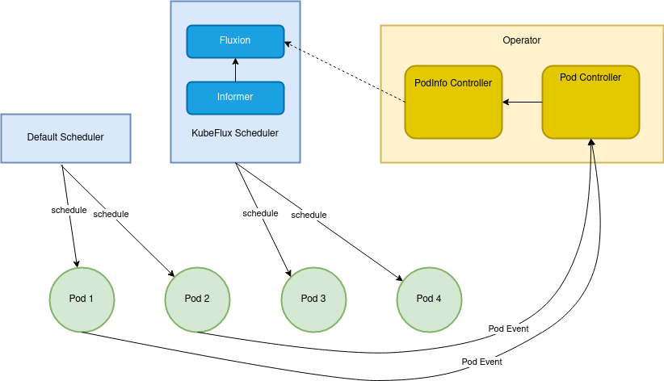
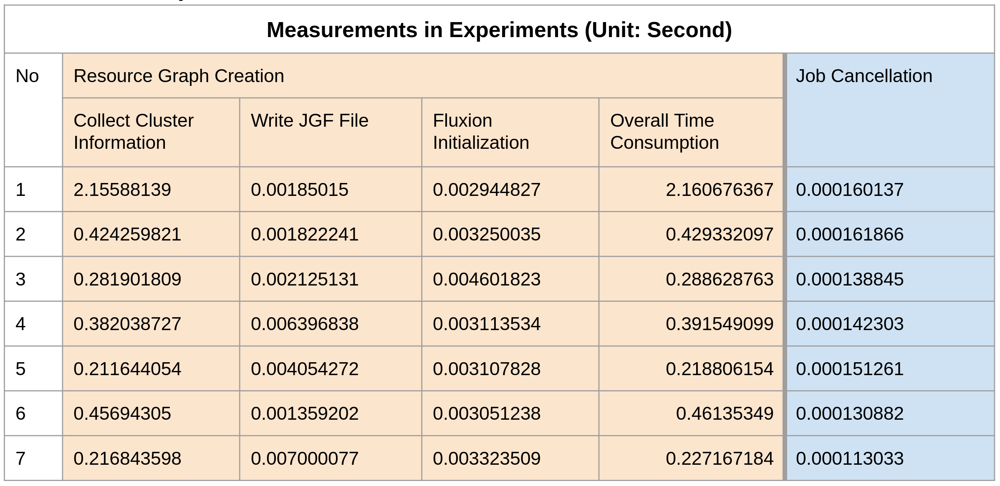

** **

## HPC Scheduling on Kubernetes with KubeFlux

** **

## 1. Vision and Goals Of The Project:

Kubernetes provides an open source platform to deploy, scale and manage container based applications. High performance computing (HPC) and cloud technologies are increasingly coupled to accelerate the convergence of traditional HPC with new simulation, data analysis, machine-learning, and artificial intelligence approaches. While the HPC and cloud paradigm is increasingly being adopted, several key mismatches between HPC and cloud technologies still preclude this paradigm from realising its full potential.

Kubernetes's default scheduler, initially intended for microservice with limited requirements, is now facing some issues in handling huge HPC load. IBM Research, Lawrence Livermore National Laboratory, and Red Hat share a common vision to bring complete HPC scheduling awareness into Kubernetes. KubeFlux, a scheduler plug-in for Kubernetes that uses Flux's advanced graph-based scheduler, Fluxion as the module taking pod placements decision. There are various aspects of workload management that needs KubeFlux attention like co-scheduling, job throughput, coordination, portability and extremely heterogeneous resources.

In this project, we are looking at the Job coordination aspect of KubeFlux. Our goal was to build a controller that can manage job cancellation at KubeFlux level when pods are completed/terminated, so that KubeFlux internal status reflects the actual state of the cluster. KubeFlux also needs a method that can dynamically update its internal status when sharing resources between Kubernetes and KubeFlux, when jobs are deployed by Kubernetes itself or other schedulers on the same shared resources. Overall our vision is to enhance KubeFlux so that it provides smooth job management service.

** **
## 2. Users/Personas Of The Project:

This is an open source project. The users range from Academic researchers to Companies who want to run containerized performance sensitive workloads on Kubernetes/OpenShift platforms. 

User 1: Accelerating Therapeutics for Opportunities in Medicine (ATOM) Consortium is developing a modelling Pipeline(AMPL) for Drug Discovery, a pipeline for building models to assist in silico drug discovery. The pipeline includes a few machine learning and deep learning frameworks used to perform prediction on large pharmaceutical datasets. These techniques often need multiple learners to be concurrently scheduled and started in order for the training to begin. Kubernetes current scheduler cannot manage jobs holistically. It requires jobs to be broken down as soon as they are received by the API server. This may cause problems like excessive number of pending pods in times of high demand which may overwhelm the scheduler and decrease the overall cluster’s performance significantly.

Use Case 1: A computational fluid dynamics (CFD) problem may execute in parallel across many hundred or even thousands of nodes using a message passing library to synchronise state. This requires specialised scheduling and job management features to allocate and launch such jobs and then to checkpoint, suspend/resume or backfill them.

Use Case 2: GROMACS is a package used for molecular dynamic simulations. These simulations are evaluating millions of interactions for billion time steps which requires huge computation hardware and time. GROMACS job executes with multi-level parallelism that distributes computational work across ensembles of simulation, multiple cores working on each domain exploiting instruction-level parallelism across those cores. Kubernetes was built for orchestrating containerized microservices applications. Currently Kubernetes scheduler naïve support for distributed memory jobs is one of the major gaps along with no job queueing system for GROMACS kind of workload.

Kubernetes typically deploy long-running services, like web servers and it is highly dynamic with pods coming and going, this still differs greatly from HPC application patterns. Through this project we intend to keep the process of job scheduling as efficient as possible along with reducing the overhead of a scheduler. This way we continue to provide any Kubernetes’s audience the plugin KubeFlux for HPC jobs along with the other features.


** **

## 3.   Scope and Features Of The Project:

There are several aspects to be addressed when using third-party software to take scheduling decisions in a Kubernetes cluster. For this project, we focus on two aspects when we integrate a plugin scheduler like Flux:

### 3.1 Introduction to Kube-Flux

Kubernetes was originally for scheduling and deploying microservices, however, the platform has garnered popularity and its lack of accommodation for different types of workloads became apparent. 

Kube-Flux is plug-in scheduler primarily focused on enabling high performance computing on Kubernetes. Kube-Flux in its current state works as a bridge between Kubernetes and Fluxion, a powerful graph library that can take scheduling decisions for HPC applications.


Single node Fluxion resource graph


Unlike Kubernetes, fluxion keeps track of cluster resources in a graph structure depicted by the diagram above. Kube-Flux achieves the integration between K8s and Flux by translating Kubernetes pod-specifications to Fluxion job specifications; pod resource allocations are then made by choosing a node with enough resources.

Fluxion’s resource graph is a powerful representation of resources that aligns more with HPC’s imperative management philosophy where the state of the resources should always match the desired state, contrary to Kubernetes’s declarative management which tries to converge between the desired and actual state.

### 3.2 KubeFlux scheduler should reflect changes in the state of its own scheduled pods

It also does not hold any information on its own pods once they are scheduled. We implemented an informer that carries updated cluster state information to the Kube-Flux resource graph. This helps to efficiently utilize the resources of a cluster and not let any job remain pending for long durations. 

### 3.3 Synchronise the KubeFlux scheduler to reflect changes in the state of pods scheduled by other schedulers.

Scheduling a pod on the cluster can be done by any third party schedulers. Broadening the scope of the project, there is a need to keep KubeFlux updated of any other scheduler that can schedule pods on the cluster except Kubernetes and itself.
KubeFlux to be aware of other schedulers that can alter the state of the cluster and update its own internal state accordingly.

** **

## 4. Solution Concept

The above scope of the project is elaborated here to represent the current working of the Kubernetes and KubeFlux simultaneously.

### 4.1 State inconsistency

The state of resources on the cluster for Kubernetes and KubeFlux is different. The number of the nodes that are occupied in the cluster, the state of the nodes that are occupied in either running, completed, terminated or cancelled state is different but incorrect for KubeFlux.  
The core scheduler of the entire Flux framework is Fluxion. Fluxion has its own internal state and resource management which keeps track of the pods created by KubeFlux. However, Fluxion does not have the capability to update the status of these pods if and when the actual status changes on the cluster. 
Below is the illustration of the same. The demonstration has a cluster with 1 worker node and 1 CPU socket. It has 16 cores in total. Initially the view of the cluster from Kubernetes and KubeFlux is that all 16 cores are available.


1. KubeFlux requested allocation of Pod 1 that requires 8 cores. Since all 16 cores were available, 8 cores were randomly assigned to the pod. 
2. KubeFlux then requested allocation of Pod 2 with 8 cores. The request is also fulfilled and the pod is created.
3. At this instance, all the cores are busy and this information is correctly visible to Kubernetes as well as KubeFlux.
4. The issue starts as soon as the state of these pods is updated. The pod 1 completed its execution and the cores are now available for allocation. However this information is only available to Kubernetes and KubeFlux is under the impression that these cores are busy and the execution is in progress.
5. Similarly, when the pod 2 completes its execution, all the cores are now available but the inconsistency is seen at KubeFlux.
6. Kubernetes has the correct view of the cluster and can successfully schedule Pod 3 on the cluster, however, KubeFlux is not able to schedule any more pods since its internal representation suggests that no more cores are available for allocation.

This state inconsistency leads to infinite wait time for any pods scheduled by KubeFlux.



State Inconsistency


### 4.2 Co-scheduling problem

The co-scheduling problem is similar to the state inconsistency problem. While the state inconsistency problem focuses on the inconsistency of state resources of its own scheduled pods for KubeFlux scheduler, the co-scheduling problem focuses on the problem of inconsistency between the Kubernetes and KubeFlux scheduler.

Below is the illustration of the same (Diagram 4.2a). The demonstration has a cluster with 1 worker node and 1 CPU socket. It has 16 cores in total. Initially the view of the cluster from Kubernetes and KubeFlux is that all 16 cores are available.

1. Kubernetes requested allocation of Pod 1 that requires 10 cores. Since all 16 cores were available, 10 cores were randomly assigned to the pod. 
2. KubeFlux then requested allocation of Pod 2 with 8 cores. Since there are only 6 cores left for allocation, the request is rejected which goes back to the scheduling queue for retry.
3. The issue with the KubeFlux scheduler not being aware of the current availability in the cluster.
4. The retry attempts by the KubeFlux scheduler are all rejected since there is no availability.
5. As soon as the pod scheduled by Kubernetes completes, KubeFlux’s scheduling request is granted and the pod is successfully allocated.

This demonstrates the co-scheduling issue and emphasises the need for KubeFlux to be aware of the cluster resources that are available at all time. Any changes to the cluster by Kubernetes scheduler or any other third party scheduler should be reflected to KubeFlux’s internal resource graph that takes the scheduling decisions.



Co-scheduling Inconsistency

## 5. Solution Concept 


### 5.1 Pod Informer





Our first contribution to Kube-Flux is the Pod Informer, a simple and efficient solution to the problem of Kube-Flux not being aware of the status of its own pods built using the Kubernetes Controller pattern which is what kubernetes uses to make sure the state of the cluster matches the desired state. We use the tools provided by controller differently however; every time Kube-Flux schedules a new pod, the pod is added to a watch list structured using 3 event watchers/handlers:

- Add a pod
- Update a pod 
- Delete a pod

Every time one of the aforementioned events is triggered, the informer calls the appropriate event handler which in turn, updates Kube-Flux’s internal state to reflect the updated status of its pods.

We designed the informer to be efficient by making incremental updates instead of recomputing the Kube-Flux state, we later highlight this in an experiment where we compare the time needed to rebuild the entire resource graph against the time it takes to update it using our informer.

### 5.2 JGF Operator


JGF Operator Overview

As a stretch goal for this project, we set out to enable co-scheduling between any 2 schedulers within kubernetes, our intuition is that 2 schedulers operating on the same cluster should reflect their changes to the cluster in a black-box component that acts as an informer that relays information between different schedulers. 
In practice, if scheduler A schedules a pod on the cluster, the black-box component should hold information about the state of the pod along with how much resources are consumed by it; the information should then be accessible to other schedulers regardless of their representation of resources; we quickly realised that meeting this goal would require a powerful and complex abstraction for exchanging information between schedulers.


The desired abstraction can be summarised as the following requirements:

- The solution needs to provide a standard representation of cluster resources.
- Schedulers wanting to make use of co-scheduling should be able to communicate with other schedulers by translating the standard representation of cluster resources and updating their own internal state however they see fit.

To overcome these conceptual challenges and provide the desired level of abstraction, we brainstormed a multi-component solution that involves using an operator. The diagram above highlights the JGF operator, our abstraction for co-scheduling. 

The JGF operator contains two vital components: the first is the pod controller which, similar to our pod informer, watches the pods on the cluster and records pod events. The pod controller creates custom resource definitions, or what we call Pod Info resources, which are objects that hold the resource usage information of all the pods present on the cluster. 

Pod Info resources are then passed on to the second vital part of the JGF Operator, the PodInfo Controller, a customizable black-box component that provides the ability for a specific scheduler to query the changes made to the cluster state by other schedulers.

While our solution covers the main conceptual challenges we cited earlier, there remains much work to be done; starting with deciding on a standard state representation that is powerful enough to satisfy the granularity requirements of a wide range of schedulers and furthermore overcoming the technical hurdles set forth by Kubernetes such how to get accurate usage metrics for a pod. With this design, we took the first steps in the long journey to enabling efficient co-scheduling in Kubernetes. 

## 6. Key Design Decisions

- Informer
    - Incremental updates triggered by pod events create smaller overhead.  
- Operator
    - Pod information (cpu/memory usages) is stored in custom resources, allowing pod information shared by other k8s components. 

## 7. Acceptance criteria

- Minimum acceptance criteria:
    - Implement a controller for job cancellation management (for pods allocated by KubeFlux).
    - The informer component of the controller shall inform KubeFlux of state changes for its allocated pods in the cluster.
    - KubeFlux shall have an updated view of the state of its allocated pods either when said state is changed or when KubeFlux needs to make a scheduling decision.
    - Test the scheduler: The scheduler will schedule a Pi calculation program, which serves as a hello world program for scientific computing. It should be able to reuse cpu resources in order to complete a batch of pods that runs a Pi calculation program. Also, the scheduler should be able to free the resources occupied by failed pods. 
- Stretch goal:
    - Propose methodologies to dynamically update Fluxion's internal graph of resources to address resource sharing between Kubernetes and Fluxion (for pods allocated by other schedulers).
    - The system shall provide an interface for adding resource sharing policies.


## 8.  Release Planning:

- Release 1
    - Learn about Kubernetes and Fluxion
        - Read about Kubernetes architecture.
        - Focus on the functionalities of Default Scheduler in Kubernetes.
        - Understand the graph-based implementation of Flux Scheduler.
    - Building the Environment
        - Install Kubernetes for different OS.
        - Install dependencies like Helm Chart, Minikube etc.

- Release 2
    - Analysis of the underlying resource graph used by Flux to represent the Kubernetes cluster
        - Getting familiar with Golang.
        - Read Resource-query documentation.
    - Designed Pi program test and reproduced the state inconsistency issue in practice
        - Setting up Kind and Local Registry.
        - Run PI program with Default Scheduler.
        - Run PI program with KubeFlux Scheduler.

- Release 3
    - Codewalk by our mentors
        - Discus possible solutions for handling state inconsistency problem.
    - Develop the informer
        - Log file for each POD.
        - Handle more PodPhases in updatePOD Function.
        - Add PodInformer (for successful PODs).
        - Save a set of Job IDs in scheduler object.
        - Add NodInformer.
        - Create corner test cases.

- Release 4
    - Create an operator through operator-sdk
        - Create CR based on POD information.
        - Delete CR after POD completion.
        - Fetch POD and read status in reconciliation loop.
        - Add experimental code in reconciliation loop.
    - Define CustomResourceDefinition (CRD).
    - Test CRD with YAML file manually.

- Release 5
    - Demo informer in an open shift cluster (real world environment).
    - Performance analysis of the Pod Informer.

## 9. Major Obstacles
- We spent a considerable amount of time trying to understand the problem. None of our teammates are familiar with HPC scheduling and Kubernetes at the same time.
- Kubernetes documents are not very beginner friendly. Sometimes it’s hard to find useful information.
- The original GROMACS test is broken with recent MPIOperator commits. We spent a lot of time on debugging and it turned out we couldn't fix the problem in reasonable time.   
- Creating kubernetes operators and CRDs in golang can be done with different code generators. Our work actually uses a combination of 2 different code generators. It took a lot of time to figure out which combination works in our project since there are a lot of tutorials based on different tools and different versions.   

## 10. Deployment

### 10.1 Environment

- Ubuntu 20.04
- Kind 0.11.1
- Kubectl 1.22.2
- Docker 20.10.9
- Go 1.16.9
- Helm 3.7.0

### 10.2 Related Repositories
    The first 3 repositories are forked from official repositories. All the development histories in this project can be found in those repositories.
- [flux-k8s](https://github.com/xyloid/flux-k8s)
- [scheduler-plugins](https://github.com/xyloid/scheduler-plugins)
- [flex-sched](https://github.com/xyloid/flux-sched)
- [JGFOperator](https://github.com/xyloid/JGFOperator) 
- [Pi calculation program](https://github.com/ArangoGutierrez/Pi.git)

### 10.3 flux-k8s & scheduler-plugins
    This part is about deploying KubeFlux in a local cluster and running a Pi calculation program.  It requires following repositories and branches.
- [flux-k8s](https://github.com/xyloid/flux-k8s) branch: `develop`
- [scheduler-plugins](https://github.com/xyloid/scheduler-plugins) branch: `dev-kubeflux`

    Here flux-k8s is used as a git submodule in scheduler-plugins

1. Start a local kind cluster with local docker registry

```bash
cd $SCHEDULER_PLUGINS/flux-k8s/example/pi
./init_kind_cluster.sh   
```

2. Make docker image for KubeFlux and push to local registry

```bash
cd $SCHEDULER_PLUGINS
make local-image
docker push localhost:5000/scheduler-plugins/kube-scheduler
```

3. Install KubeFlux

```bash
cd $SCHEDULER_PLUGINS/manifests/kubeflux/charts/
helm install scheduler-plugins ./as-a-second-scheduler/ 
```

4. Make docker image for Pi calculation program and push to local registry

```bash
cd $SCHEDULER_PLUGINS/flux-k8s/example/pi
make build-image && make push-image-local
make build-segfault-image && make push-segfault-image-local
```

5. Run Pi calculation program

```bash
kubectl create -f ./pi-job-default.yaml
kubectl create -f ./pi-job-kubeflux.yaml
Kubectl get pods
```

6. Get KubeFlux logs

```bash
kubectl logs -n scheduler-plugins $(kubectl get pod -l component=scheduler -n scheduler-plugins -o jsonpath="{.items[0].metadata.name}")
```

7. Undeploy KubeFlux

```bash
helm uninstall scheduler-plugins 
```

### 10.4 JGFOperator
This part is about deploying a Kubernetes Operator to a local cluster. It requires following repositories and branches.
- [flux-k8s](https://github.com/xyloid/flux-k8s) branch: `develop`
- [scheduler-plugins](https://github.com/xyloid/scheduler-plugins) branch: `dev-kubeflux` 
- [JGFOperator](https://github.com/xyloid/JGFOperator) branch: `main`

1. Setup a local cluster and install KubeFlux as described in 9.3 step 1 to 3.
2. Build docker image for JGFOperator and push to local registry
```bash
cd $JGFOperator
make docker-build
make docker-push-local 
```

3. Deploy JGFOperator
```bash
make deploy-local
```

4. Verify deployment 
```bash
kubectl get crd
kubectl get podinfoes
```

5. Check log of the operator

```bash
kubectl logs -n jgfoperator-system $(kubectl get pods -n jgfoperator-system -o jsonpath="{.items[0].metadata.name}") manager
```

6. Undeploy

```bash
make undeploy
```

### 10.5 Time Measurement

This part is about measuring time consumption of several key operations in KubeFlux. A remote cluster (an OpenShift cluster on IBM Cloud) is used in the process. It requires following repositories and branches.
- [flux-k8s](https://github.com/xyloid/flux-k8s) branch: `dev_operator`
- [scheduler-plugins](https://github.com/xyloid/scheduler-plugins) branch: `dev-kubeflux-measurement`
- [flex-sched](https://github.com/xyloid/flux-sched) branch: `measurement-dev`

1. Setup a remote cluster for kubectl

    The default kubeconfig file is “~/.kube/config”. We can modify the content of this file to make kubectl connect to a remote cluster.

2. Build docker image for KubeFlux and push to Dockerhub

```bash
cd $SCHEDULER_PLUGINS
make dockerhub-image
```

3. Install KubeFlux to the remote cluster

```bash
cd $SCHEDULER_PLUGINS/manifests/kubeflux/charts/
helm install scheduler-plugins ./as-a-second-scheduler/ 
```

4. Deploy test program

```bash
cd $SCHEDULER_PLUGINS/manifests/kubeflux/measuremnt/
Kubectl create -f ./pi-job-kubeflux.yaml
```

5. Get KubeFlux logs

```bash
kubectl logs -n scheduler-plugins $(kubectl get pod -l component=scheduler -n scheduler-plugins -o jsonpath="{.items[0].metadata.name}")
```

#### Experiment Results

We performed the above experiment 7 times on a remote cluster with 8 worker nodes. Each worker node has 4 CPU cores and 16 Gb memory. In each job, 16 pods are deployed. Each pos has a cpu limit of 1 and a cpu request of 1. Then we read the time measurements from the log file. The results are listed in the table below. Note that in the first experiment, the Collect Cluster Information step took much more time than rest experiments. The possible reason is that when that information is being collected, it involves etcd, API server and some other Kubernetes components. There could be some caching mechanism behind this behavior.  



## 11. Future Scope

Our project can be extended towards making KubeFlux a competent HPC scheduling solution for Kubernetes:
- Designing a standard process for synchronizing a plug-in scheduler’s internal state with the Kubernetes cluster state
    - Getting a proper figure of resource utilization from running pods (translating Kubernetes cpu measurements to tangible info)
    - Designing interface with a generic representation of the kubernetes cluster state that plug-in schedulers can access.

We start with unravelling the technical challenges we faced while resolving the state synchronisation problem among schedulers. We listed those challenges below for future reference.

1. Kubernetes has 3 different ways of specifying pod resource needs.
    - Priority 1: Guaranteed Pod - complete resource usage specification
        - Example : cpuLimit(maximum resources needed) and cpuRequest (minimal resources needed) need to be equal
    - Priority 2: Burstable Pod - incomplete resource usage specification 
        - Example: cpuRequest and cpuLimit need not be equal.
    - Priority 3: Best-Effort Pod - no resource usage specification

2. Resources usage fluctuations
    - Actual resource usage could be different from what in the specification file
    - Only kubelet knows the exact resource usage figure of a node.

3. Imperative HPC management philosophy doesn’t align with the declarative Kubernetes management philosophy
    - Kubernetes goal when supplied with a job specification is to converge towards a desired state mentioned in said specification. It does not guarantee that the actual state is always equal to the desired state.
    - Can not implement state synchronisation on cpu level.
    - K8s has sophisticated node sharing mechanisms 

4. Potential latency introduced by the operator when performing high-throughput jobs.

